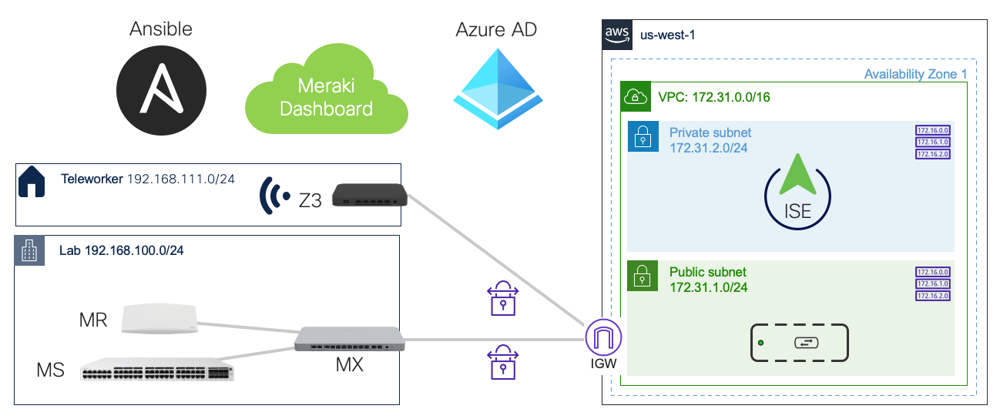

# Cisco ISE with Meraki in AWS

This demo was created for use with the Cisco ISE with Meraki Webinar (https://cs.co/ise-webinars) on October 5, 2021.  Catch the recording in YouTube @ https://cs.co/ise-videos

This `ise_in_aws.yaml` playbook will create :
- a VPC and it's other necessary resources
- ISE 3.1
- Meraki vMX
- Linux VM to ping while ISE boots so you will feel confident that it's going to work!
You will need at least one additional Meraki MX or Z to act as a hub and terminate the other side of the VPN connection.





## Quick Start

1. Clone this repository:  

    ```bash
    git clone https://github.com/1homas/ISE_with_Meraki_in_AWS.git
    cd ISE_with_Meraki_in_AWS
    ```

1. Create your Python environment and install Ansible with other Python packages for AWS and ISE :

    ```bash
    pip install --upgrade pip
    pip install pipenv
    pipenv install --python 3.9
    pipenv install ansible boto boto3 botocore ciscoisesdk jmespath 
    pipenv shell
    ansible-galaxy collection install cisco.ise
    ```

    If you have any problems installing Python or Ansible, see [Installing Ansible](https://docs.ansible.com/ansible/latest/installation_guide/intro_installation.html).

1. Export your various keys, tokens, and credentials for ISE, Meraki, and AWS APIs into your shell environment.  You can store these in one or more `*.env` then load them with the `source` command.

    ```bash
    # AWS IAM API Keys
    export AWS_REGION='us-west-1'
    export AWS_ACCESS_KEY='AKIAIOSF/EXAMPLE+KEY'
    export AWS_SECRET_KEY='wJalrXUtnFEMI/K7MDENG/bPxRfi/EXAMPLE+KEY'
    ```

    ```bash
    # Meraki API Authentication Key
    export MERAKI_KEY='EXAMPLE_KEYc320e12ee407159487a4cabc41abb'
    ```

    ```bash
    # ISE REST API Credentials
    export ise_username='admin'
    export ise_password='C1sco12345'
    export ise_verify=false
    ```

    ```bash
    # Keep *.env files in a .env folder in your home directory
    # Use source to load environment variables from *.env files
    source ~/.env/*.env
    ```

1. Edit the `vars/main.yaml` and change the `meraki_org_name` to yours. You will want to review the other settings and change them to match your environment:
    - AMI identifiers for your AWS region if not `us-west-1`
    - your desired network CIDR ranges
    - your desired instance types
    - your default password(s) or pre-shared keys

1. Run the Ansible playbook:  

    ```bash
    ansible-playbook ise_in_aws.yaml
    ```

1. Due to a Meraki VPN API error, you will need to manually add the vMX Local Network definition in the Meraki Dashboard to advertise the VPC subnet:
   1. In the [Meraki Dashboard](https://dashboard.meraki.com), view your `ISEinAWS` network
   2. Choose `Security & SD-WAN > Configure > Site-to-Site VPN` and for the Local Networks, **Add a Local Network**:
       | Network        | VPN mode | Subnet          |
       |----------------|----------|-----------------|
       | ISEinAWS       | Enabled  | `172.31.0.0/16` |
    > ⚠ If you cannot ping or SSH to the `Ping` Linux VM this is probably the reason!

1. When ISE is up, you may configure it using the additional playbook :

    ```bash
    ansible-playbook ise.configuration.yaml
    ```

1. When you are finished playing with it, you may terminate the instances:

    ```bash
    ansible-playbook ise_in_aws.terminate.yaml
    ```


## Manual Configuration in AWS Console and Meraki Dashboard

In case you wondered exactly what these Ansible playbooks are doing ... here is how to do it the hard way!  If you want to do it the old-fashioned way or just understand what the time spent on automation is saving you from!


### Create an SSH Key Pair

Your AWS instance(s) will have a public IP address so anyone can - and will - eventually find it and try to login and use it. For this reason, AWS does not allow the use of normal passwords. Instead, they use a private/public cryptographic key pair which is *much* stronger than a password.

1. Login to the [Amazon Web Services (AWS) Console](https://console.aws.amazon.com) as a root user (not IAM user) of your account
2. Verify or choose your **Region** in the drop-down menu next to your account name
3. Open the **Services** menu and choose **Compute > EC2**
4. From the left menu, choose **Network & Security > Key Pairs** 
5. Click **Create Key Pair**, fill in the attributes below, and click **Create Key Pair**
    - Name: `ISEinAWS`
    - Key pair type: **RSA**
    - Private key file format: **.pem**
6. When prompted, save the `ISEinAWS.pem` private key file to your home directory in a folder named `.ssh` (`~/.ssh/ISEinAWS.pem`)
7. If you are using macOS, Linux, or WSL, change the file permissions so it cannot be viewed by others or accidentally overwritten or deleted by you:

    ```bash
    chmod 400 ~/.ssh/ISEinAWS.pem
    ```

    > 🛑 Do not lose this private key file! You will not be able to login to your AWS EC2 instances configured with the corresponding public key!

When you create instances in AWS, you may choose to put the matching public key into your VMs to authorize your SSH login. To use your key with AWS EC2 instances, you will connect using SSH and authenticate with the `-i` *identity file* option which is your `ISEinAWS.pem` private key :

```bash
ssh -i ~/.ssh/ISEinAWS.pem admin@{hostname | IP}
```


### Create AWS VPC

1. In the [AWS Console](https://console.aws.amazon.com), go to **Services > Networking & Content Delivery > VPC**
2. Choose your region: `us-west1`
3. Select `Create VPC`
    - Name: `ISEinAWS` 
    - IPv4 CIDR: `172.31.0.0/16`
    - Tenancy: `Default`
    - Add Tag: `Project : ISEinAWS`
    Click `Create VPC`


### Create Subnets

1. From the left menu, select `Virtual Private Cloud > Subnets`
2. Click `Create Subnet`
3. Create your Public subnet for the Meraki vMX:
   1. VPC ID: `ISEinAWS`
   2. Subnet name: `Public-Subnet`
   3. Availability Zone: `No preference` or *choose your desired AZ*
   4. CIDR: `172.31.1.0/24`
4. Select `Add a New Subnet` for the Private subnet with ISE
   1. VPC ID: `ISEinAWS`
   2. Subnet name: `Private-Subnet`
   3. Availability Zone: `No preference` or *choose your desired AZ*
   4. CIDR: `172.31.2.0/24`
5. Select `Create Subnet`
6. Check ✅ `Public-Subnet`, choose `Actions > Modify auto-assign IP settings`, check ✅ `Enable auto-assign public IPv4 address` and click `Save`


### Create Internet Gateway

1. From the left menu, select `Virtual Private Cloud > Internet Gateways`
1. Click `Create Internet Gateway`
   - Name: `vMX-IG`
   Click `Create Internet Gateway`
1. Associate the Internet Gateway to the VPC by selecting `Actions > Attach to VPC` > `ISEinAWS` and click `Attach Internet Gateway`


### Create Route Tables

1. From the left menu, select `Virtual Private Cloud > Route Tables`
2. Click `Create Route Table`
3. Create the *Public* Route Table
   - Name: `Public-RT`
   - VPC: `ISEinAWS`
   Click `Create Route Table`
4. From the left menu, select `Virtual Private Cloud > Route Tables`
5. Create the *Private* Route Table
   - Name: `Private-RT`
   - VPC: `ISEinAWS`
   Click `Create Route Table`
6. Associate the respective route tables and subnets:
   1. Check ✅ `Public-RT` and select the `Subnet Assocations` tab below
   2. Click `Edit Subnet Associations`, check ✅ `Public-Subnet` and click `Save Associations`
   3. Check ✅ `Private-RT` and select the `Subnet Assocations` tab below
   4.  Click `Edit Subnet Associations`, check ✅ `Private-Subnet` and click `Save Associations`


### Edit Route Tables

1. Check ✅ `Public-RT`, select the `Routes` tab below, and click `Edit Routes`
2. Click `Add Route` and add a `0.0.0.0/0` default route to the target type `Internet Gateway` > `igw-*` then click `Save Changes`
3. Your Public Route Table should now look like this:
    | Destination     | Target                |
    |-----------------|-----------------------|
    | `172.31.0.0/16` | local                 |
    | `0.0.0.0/0`     | igw-0ed2b71a84a9588ac |


## Generate Cisco Meraki vMX Authentication Token

1. Login to the [Meraki Dashboard](https://dashboard.meraki.com)
2. From the network menu, choose `Create a New Network`
    - Network name: `ISEinAWS`
    - Network type: `Security Appliance`
    - Network Configuration: `Default Meraki configuration`
    - Check ✅ the **vMX Serial Number** you want to use
    Click `Create Network`
3. Scroll down and select `Generate Authentication Token` and copy the text for use in the `User Data` of the vMX instance in the next section.


### Create Cisco Meraki vMX Instance

1. In the AWS Search Box at the top of the page, search for "Meraki vMX" and open the link to [Cisco Meraki vMX](https://aws.amazon.com/marketplace/pp/prodview-o5hpcs2rygxnk)
1. Click `Continue to Subscribe`
1. Click `Continue to Configuration`
1. Choose your region (`us-west`) and click `Continue to Launch`
   1. ami-09db17cd0ae68ce37
2. For **Choose Action**, choose `Launch Through EC2` then click `Launch`
3. Choose the appropriate Instance Type, `c5.large` and click `Next: Configure Instance Details`
4. For Configure Instance Details use the settings:
    - Network: `vpc-* | ISEinAWS`
    - Subnet: `subnet-* | Public-Subnet`
    - Auto-assign Public IP : `Enable`
    - User data: `As Text`, *paste the vMX Authentication Token from the Meraki Dashboard*
5. Click `Next: Add Storage`
6. Click `Next: Add Tags`
7. Click `Add Tag` and use a key:value of `Name` : `vMX`
8. Click `Next: Configure Security Group`
9. For the Security Group, use the settings:
   - Assign a security group : `⦿ Create a new security group`
   - Security group name: `vMX-SG`
   - Description: `vMX-SG`
   - Change the existing rule to be:
     - Type : `All Traffic`
     - Description: `Allow All`
11. Click `Review and Launch`
12. Click `Launch`
13. Select your Key Pair `ISEinAWS.pem`, acknowledge that you have the private key file and click `Launch Instances`
14. After launching, select `View Instances` and you should see your instance running!
15. Check ✅ your vMX, choose `Actions > Networking > Change Source / destination check`, ✅  `Stop` Source / destination checking and click `Save`


### Create a Linux Test Instance for Pinging

1. In the AWS Console, go to `Services > EC2`
1. Click `Launch Instances`
1. Find a free tier Linux AMI such as the `Amazon Linux 2 AMI (HVM)` and click it's `Select` button
2. Choose the `t2.micro` instance type and click `Next: Configure Instance Details`
3. For Configure Instance Details use the settings:
    - Network: `vpc-* | ISEinAWS`
    - Subnet: `subnet-* | Private-Subnet`
    - Auto-assign Public IP : `Enable)`
4. Click `Next: Add Storage`
5. Click `Next: Add Tags`
6. Click `Add Tag` and use a key:value of `Name` : `Ping`
7. Click `Next: Configure Security Group`
8. For the Security Group, use the settings:
   - Assign a security group : `⦿ Create a new security group`
   - Security group name: `SSH+Ping`
   - Description: `SSH+Ping`
   - Click `Add Rule` and choose :
     - Type: `All ICMP-IPv4`
     - Source: `0.0.0.0/0`
9. Click `Review and Launch`
10. Click `Launch`
11. Select your Key Pair `ISEinAWS.pem`, acknowledge that you have the private key file and click `Launch Instances`
12. Click `View Instances` and you should see your instance running!
13. Login to your Linux VM is you need to do any troubleshooting or add software:

    ```bash
    ssh -i "~/.ssh/ISEinAWS.pem" ec2-user@{ hostname | IP } 
    ```


### Create Site-to-Site VPN Connection

1. In the [Meraki Dashboard](https://dashboard.meraki.com), view your `ISEinAWS` network
2. Choose `Security & SD-WAN > Configure > Site-to-Site VPN`
3. For the Site-to-Site VPN settings, use:
   - Type: `Spoke`
   - Local network:
       | Network        | VPN mode | Subnet          |
       |----------------|----------|-----------------|
       | Private-Subnet | Enabled  | `172.31.2.0/24` |
   -  NAT traversal : `⦿ Automatic`
4. Click `Save Changes`
5. Choose `Security & SD-WAN > Appliance Status`  and you should now see the vMX public WAN address and it should be **Active**!

Now you will connect your other MX in the mesh to the vMX

1. Choose your Meraki `Lab` network for your physical, on-premise MX
2. Choose `Security & SD-WAN > Configure > Site to Site VPN`
3. For the Site-to-Site VPN settings, use:
   - Type: `Hub (Mesh)`
   - Local Networks :
     > 💡 you may use a Single LAN or VLANs - I used a Single LAN to keep it simple
     | Network     | VPN mode | Subnet |
     |-------------|----------|--------|
     | Main Subnet | Enabled  | `192.168.101.0/24`
   -  NAT traversal : `⦿ Automatic`
   -  If you have alreaady configured a Meraki MX has a hub, you should see `ISEinAWS` under **Remote VPN participants**!
4. Click `Save Changes`


### Update the Private Route Table

You will need to update the `Private-RT` to the `Lab` MX

1. In the AWS Console, go to `Services > VPC` and select the `Route Tables`
2. Check ✅ `Private-RT` and select the `Routes` tab below
3. Click `Edit Routes` 
4. Select `Add Route`
    - Destination: `192.168.0.0/16`
    - Target: `Instance` > `i-* | vMX`
   Click `Save Changes`
4. Select `Add Route`
    - Destination: `0.0.0.0/0`
    - Target: `Internet Gateway` > `igw-*`
   Click `Save Changes`
5. Your **Private Route Table** should now look like this:
   | Destination      | Target    |
   |------------------|-----------|
   | `172.31.0.0/16`  | local     |
   | `192.168.0.0/16` | i-* / vMX |
   | `0.0.0.0/0`      | igw-*     |
6. You can now try to ping through your site-to-site VPN to the Linux instance 


### Ping the Linux Instance

1. In the AWS Console, go to `Services > EC2` and
2. Select the `Ping` Linux VM instance and locate it's `Private IPv4 addresses`
3. SSH to the instance:

    ```bash
    ssh -i ~/.ssh/ISEinAWS.pem ec2-user@172.31.2.35
    ```


### Create Cisco ISE Instance


1. In the AWS Search Box at the top of the page, search for "Cisco ISE" and open the link to [Cisco Identity Services Engine (ISE)](https://aws.amazon.com/marketplace/pp/prodview-uvsybra7r3iug?sr=0-1&ref_=beagle&applicationId=AWSMPContessa)
1. Click `Continue to Subscribe`
2. Click `Continue to Configuration`
3. For Configure This Software, choose:
    - Delivery Method: `Cloud Formation Template` then choose the normal or GovCloud version of `Cisco Identity Services Engine (ISE)`
    - Software Version: `3.1`
    -  Region: `us-west`
    Click `Continue to Launch`
4. For Launch this Software, choose: `Launch CloudFormation` then click `Launch`
5. Choose `Upload a template file`, choose your file (`files/ISE-3-1-518.CFT.yaml`) and click `Next`
6. Verify and complete the ISE CloudFormation Parameters then click `Next`
    - Stack Name: `ISE-3-1-518`
    - AMIid: `ami-00a1a68f5519aa150`    # ISE in us-west-1
    - Hostname: `ise`
    - KeyName / Instance Key Pair: `ISEinAWS`
    - Management Security Group: `ISE`
    - Management Network: `Private-Subnet`
    - TimeZone: `America/Los_Angeles`
    - ISEInstanceType: `c5.4xlarge`
    - EBS Encryption : `false`
    - Volume Size / StorageSize: `300`
    - DNSDomain: `aws.local`
    - NameServer: `208.67.222.222`
    - NTPServer: `time.nist.gov`
    - ERS: `yes`
    - OpenAPI: `yes`
    - pxGrid: `no`
    - pxGridCloud: `no`
    - ERS: `yes`
    - password: `C1sco12345`
    - ConfirmPwd: `C1sco12345`
    Click `Next`
7. Review the Stack Options then click `Next`
8. Do a final review of the parameters then click `Creat Stack`

To create another instance:
1. In the AWS Console, navigate to **CloudFormation > Stacks**
2. Select `ISE-3-1-518`
3. Choose Create Stack > With New Resources (standard)
4. For Create Stack, choose `Upload a template file`, choose your file (`ISE-3-1-518.CFT.yaml`) and click `Next`
5. choose a unique Stack Name (`ISE-3-1-518`)

SSH to the ISE console
```bash
ssh -i "~/.ssh/ISEinAWS.pem" admin@{ hostname | IP }
```


## Resources
- [Installing Ansible](https://docs.ansible.com/ansible/latest/installation_guide/intro_installation.html) for all platforms
- [Cisco Meraki vMX en AWS](https://www.youtube.com/watch?v=KfbihKbe-HI)
- [AWS re:Invent 2019: AWS Networking Fundamentals (NET201-R2)](https://www.youtube.com/watch?v=gj4CD73Wmns) provides an excellent overview of the networking elements that are automatically created when using the [Launch Instance wizard](https://console.aws.amazon.com/ec2/home#LaunchInstanceWizard)
- [amazon.aws](https://docs.ansible.com/ansible/latest/collections/amazon/aws/) Ansible collection documentation
- [cisco.meraki](https://docs.ansible.com/ansible/latest/collections/cisco/meraki/index.html) Ansible Documentation
- [community.aws](https://docs.ansible.com/ansible/latest/collections/community/aws/) Ansible collection documentation
- [cisco.ise](https://ciscoise.github.io/ansible-ise/main/plugins/index.html) Ansible Documentation
- [Best practices for managing AWS access keys](https://docs.aws.amazon.com/general/latest/gr/aws-access-keys-best-practices.html)


## License

The examples in this repository are licensed under the [Cisco Sample Code License](https://developer.cisco.com/site/license/cisco-sample-code-license/).


